# K-Drama Recommendation System

A content-based hybrid recommendation system for Korean dramas using
semantic embeddings, metadata, and similarity search with KNN.

## Features
- Semantic similarity using text embeddings
- Actor-based similarity
- Metadata re-ranking (rating, episodes, release year)
- Interactive Streamlit app
- Poster retrieval via TMDB API

## Methodology
The system combines:
- Cosine similarity on narrative embeddings
- Cosine similarity on cast embeddings
- Re-ranking using normalized metadata features

Final recommendations are generated using a weighted scoring strategy.

```mermaid
flowchart TD
    Start([Inicio main]) --> LoadInputs[Cargar inputs]

    LoadInputs --> Mids[(Mids_To_Process<br/>parquet GCS)]
    LoadInputs --> Sim[(Material_similarity<br/>BigQuery)]
    LoadInputs --> Sellout[(weekly_sell_out<br/>BigQuery)]
    LoadInputs --> Customers[(master_customer<br/>retail y non_retail)]

    Sellout --> Agg[Agregar sell-out por canal]
    Customers --> Agg

    Mids --> Filter[Filtrar similares de MIDs a procesar]
    Sim --> Filter

    Filter --> SelfRef{¿Self-reference?<br/>Mid = Similar_mid<br/>registro único}

    SelfRef -->|Sí| Zero1[Forecast = 0]
    SelfRef -->|No| Loop[Loop por cada MID]

    Loop --> Sort[Ordenar similares por Rank ascendente]
    Sort --> Merge[Merge con sell-out del canal]

    Merge --> HasData{¿Hay datos<br/>después del merge?}
    HasData -->|No| Zero2[Forecast = 0<br/>+ warning en log]
    HasData -->|Sí| ModelCall[Llamar a model]

    ModelCall --> Penetration[Calcular penetración de canal]
    Penetration --> SizeCheck{¿len data_series &gt; 10?}

    SizeCheck -->|No| WAvg[Promedio ponderado<br/>pesos 0.5 a 1.0]
    SizeCheck -->|Sí| ARIMA[auto_arima<br/>seasonal=False<br/>n_periods=9]

    ARIMA --> ARIMAOk{¿auto_arima<br/>tuvo éxito?}
    ARIMAOk -->|No| WAvg
    ARIMAOk -->|Sí| LastPred[Tomar prediction último valor]

    WAvg --> PenLow{¿Penetración &lt; 30%?}
    LastPred --> PenLow

    PenLow -->|Sí| Boost[Boost x 1.2]
    PenLow -->|No| NoBoost[Sin boost]

    Boost --> Cap[Cap: forecast ≤ 1.5x histórico máximo]
    NoBoost --> Cap

    Cap --> Negative{¿Forecast ≤ 0?}
    Negative -->|Sí| MeanFallback[Fallback a media]
    Negative -->|No| Final[Forecast final]
    MeanFallback --> Final

    Final --> Collect[Concatenar resultados por canal]
    Zero1 --> Collect
    Zero2 --> Collect

    Collect --> SaveR[(retail.csv<br/>GCS)]
    Collect --> SaveNR[(non_retail.csv<br/>GCS)]

    SaveR --> End([Fin])
    SaveNR --> End

    classDef inputData fill:#e1f0fb,stroke:#185FA5,stroke-width:1.5px,color:#042C53
    classDef output fill:#d6f0e0,stroke:#0F6E56,stroke-width:1.5px,color:#04342C
    classDef decision fill:#fff4d6,stroke:#A8740F,stroke-width:1.5px,color:#412402
    classDef issue fill:#fce4e4,stroke:#A53D3D,stroke-width:1.5px,color:#501313
    classDef process fill:#eeedfe,stroke:#534AB7,stroke-width:1.5px,color:#26215C

    class Mids,Sim,Sellout,Customers inputData
    class SaveR,SaveNR output
    class SelfRef,HasData,SizeCheck,ARIMAOk,PenLow,Negative decision
    class ARIMA,LastPred,Zero1,Zero2,MeanFallback issue
    class Agg,Filter,Loop,Sort,Merge,ModelCall,Penetration,WAvg,Boost,NoBoost,Cap,Final,Collect process
```

